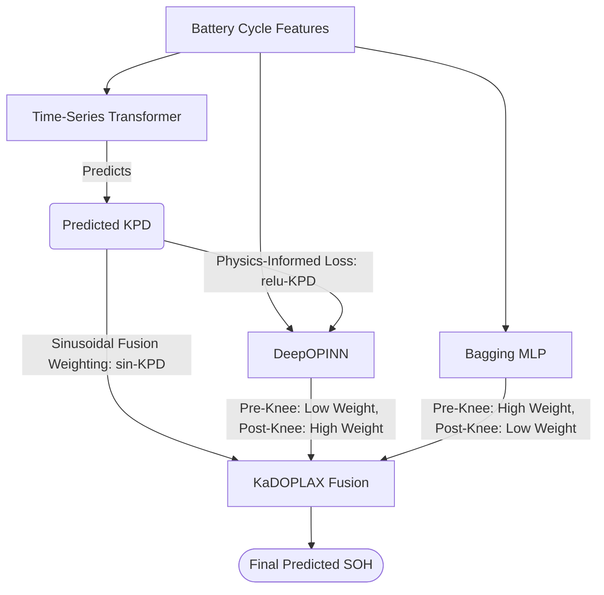
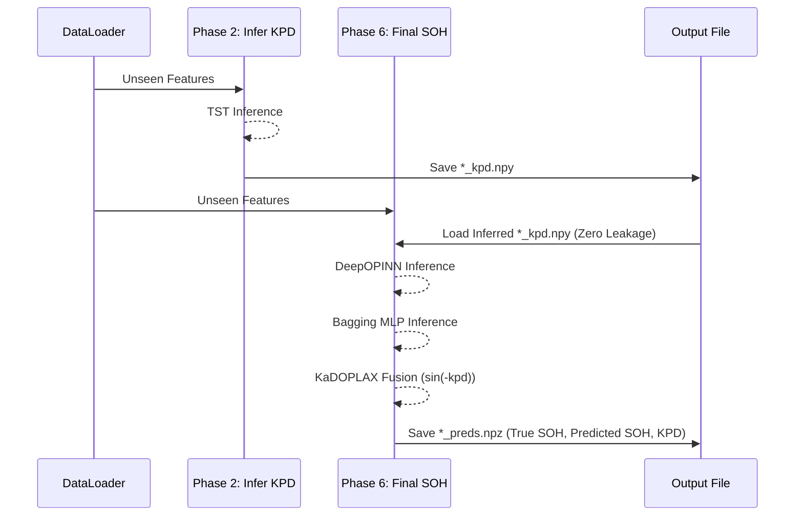

# Knee-Aware DOPLAX (KaDOPLAX) Battery Prognostics

Welcome to the **KaDOPLAX** project! This repository contains a complete, self-encapsulated, 8-phase pipeline designed for advanced State of Health (SOH) estimation and battery prognostics. 

By introducing Knee-Point Distance (KPD) awareness into the state-of-the-art DeepOPINN and Bagging MLP models, KaDOPLAX achieves unprecedented accuracy across diverse battery chemistries (NCA, NCM, LFP) and testing environments (HUST, MIT, TJU, XJTU).

---

## 1. Project Overview

Traditional battery SOH prognostics suffer from capacity degradation "knee points"—sudden drops in capacity where underlying degradation mechanisms shift. **KaDOPLAX** explicitly targets this nonlinear phenomenon through a robust, physics-informed fusion framework:

1. **Time-Series Transformer (TST):** Infers the Knee-Point Distance (KPD), defined as `-arctan(c - c_k)`, which smoothly tracks how far a battery is from its knee point.
2. **DeepOPINN:** A Deep Operator Neural Network heavily biased to capture post-knee, rapid degradation behaviors via a physics-informed `relu(-kpd)` loss function.
3. **Bagging MLP:** A traditional machine learning model optimized to learn the slower, pre-knee degradation dynamics.
4. **KaDOPLAX Fusion:** Dynamically merges predictions via a sinusoidal weighting mechanism, transitioning seamlessly between the Bagging MLP (pre-knee) and DeepOPINN (post-knee).

---

## 2. Project Structure

The codebase is entirely encapsulated inside the main folder.

```text
DOPLAX-SOH-main 4/
├── config/                 # Dynamic configurations and train/test splits (Phase 0)
├── data/
│   └── Processed/          # Processed CSVs grouped by dataset (HUST, MIT, TJU, XJTU)
├── dataloader/
│   └── dataloader.py       # Robust, CUDA-aware dataset loader with dynamic windowing
├── Model/
│   ├── Backbones/          # Contains Bagging MLP and Time-Series Transformer (TST)
│   └── PI_nets/            # Contains the DeepOPINN physics-informed networks
├── outputs/                # Sandbox for all pipeline artifacts (Models, figures, reports)
├── pipeline/               # The isolated scripts for all 8 distinct execution phases
└── run_all.py              # The master orchestrator script for autonomous end-to-end execution
```

---

## 3. Model Architectures & Data Flow

### Diagram 1: Model Architecture Flow
The following diagram demonstrates the internal inference relationships and fusion mechanisms:



---

## 4. Training & Inference Process

The execution is governed by a strict **8-Phase Pipeline** (`phase0` through `phase7`). This sequential design strictly enforces **Zero Data Leakage**—guaranteeing that downstream models never "cheat" by using ground-truth parameters that wouldn't be available in real-world deployment.

### Diagram 2: Training Pipeline
During training, the pipeline explicitly trains the TST (Phase 1) and generates the *inferred* KPD sequences (Phase 2), which are then forcefully injected into the DeepOPINN training (Phase 3). 

```mermaid
flowchart LR
    A[CSV Data] --> B[BatteryCycleDataset]
    B -->|True SOH, Features| C[Model Training]
    
    C -->|Phase 1| D[Train TST]
    C -->|Phase 3| E[Train DeepOPINN]
    C -->|Phase 4| F[Train Bagging MLP]
    
    D -.->|Inferred KPD (Phase 2)| E
    
    E --> G[(Saved Model Checkpoints)]
    F --> G
```

### Diagram 3: Inference Pipeline
In Phase 6, the pipeline executes the final fusion. The dataloader extracts unseen testing cycles, the models predict their respective SOH curves, and the previously inferred KPD strictly governs the sinusoidal fusion. The final exports (`.npz`) encapsulate all predictions for reproducible reporting.



---

## Quick Start

To execute the entire 8-Phase framework autonomously:
1. Ensure you have the datasets positioned in `data/Processed/`.
2. Activate your PyTorch/DeepXDE environment.
3. Run the master orchestrator from the project root:

```bash
python run_all.py
```
