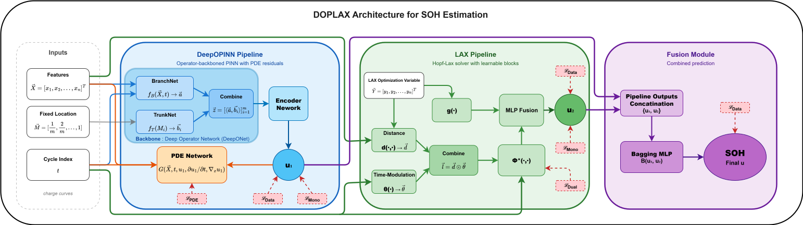
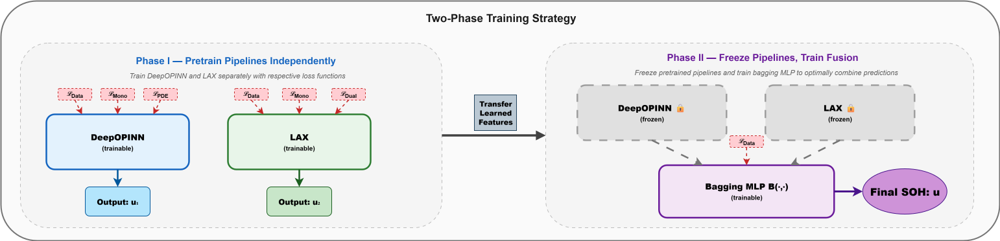

<h1 align="center">DOPLAX: Unified Physics-Informed Framework via Operator Learning and Hopf–Lax Solver for Battery Health Estimation</h1>

<p align="center">
  <a href="https://pytorch.org/"></a>
  <a href="https://www.python.org/"></a>
  <a href="https://github.com/"></a>
</p>
<p align="center">
  <b>Anonymous code repository for submission</b>
</p>


---

## 📋 Table of Contents
- [Overview](#-overview)
- [Architecture](#-architecture)
- [Installation](#-installation)
- [Dataset Preparation](#-dataset-preparation)
- [Training Models](#-training-models)
- [Inference](#-inference)
- [Visualization](#-Visualization)
- [Loss Functions](#-loss-functions)
- [References](#-references)

---

## 🔬 Overview

**DOPLAX** is a physics-integrated framework for accurate State-of-Health (SOH) estimation of lithium-ion batteries. It addresses the challenges of nonlinear degradation and dataset shift across cycling protocols by unifying two physics-informed approaches:

1. **DeepOPINN**: A DeepONet-backboned Physics-Informed Neural Network (PINN) enforcing PDE residuals for operator-level feature extraction.
2. **LAX Network**: A novel solver-style network derived from the Hopf–Lax representation of Hamilton–Jacobi (HJ) equations with learned Hamiltonian and dual-convexity regularization.
3. **Bagging Fusion Module**: A learned fusion mechanism that optimally combines predictions from both pathways


**Comprehensive Evaluation**: Validated on four public benchmarks (XJTU, TJU, MIT, HUST).

---

## 🏗️ Architecture

### DOPLAX Framework

<p align="center">
  
</p>


### Two-Phase Training Strategy

<p align="center">
  
</p>


---

## ⚙️ Installation

### Prerequisites

- Python 3.8+
- PyTorch 2.0+
- CUDA 11.8+ (recommended for GPU acceleration)

### Setup

```bash
# Clone the repository
git clone https://anonymous.4open.science/r/DOPLAX-SOH-4765/
cd DOPLAX-SOH

# Create conda environment
conda create -n doplax python=3.10
conda activate doplax

# Install PyTorch (adjust CUDA version as needed)
pip install torch torchvision torchaudio --index-url https://download.pytorch.org/whl/cu118

# Install dependencies
pip install -r ./requirements.txt
```

### Requirements

```txt
matplotlib
numpy
pandas
regex
scikit-learn
seaborn
scipy
natsort
deepxde
optuna
openpyxl
plotly
h5py
tqdm
mpld3
umap-learn
openTSNE
```

---

## 📊 Dataset Preparation

DOPLAX supports four public battery datasets. Download and organize them as follows:

### Supported Datasets

| Dataset | Batteries | Source |
|---------|-----------|--------|
| **XJTU** | 55 | [Link](https://github.com/wang-fujin/PINN4SOH/tree/main/data) |
| **TJU** | 130 | [Link](https://github.com/wang-fujin/PINN4SOH/tree/main/data) |
| **MIT** | 125 | [Link](https://github.com/wang-fujin/PINN4SOH/tree/main/data) |
| **HUST** | 77 | [Link](https://github.com/wang-fujin/PINN4SOH/tree/main/data) |

 **Raw data can be obtained from the following links:**

https://github.com/wang-fujin/PINN4SOH?tab=readme-ov-file#4--additional-information

### Directory Structure

```
data/
└── Full/
    ├── XJTU data/
    │   ├── 2C_battery-1.csv
    │   ├── 2C_battery-2.csv
    │   └── ...
    ├── TJU data/
    │   ├── NCA/
    │   ├── NCM/
    │   └── NCM_NCA/
    ├── MIT data/
    │   ├── 2017-05-12/
    │   ├── 2017-06-30/
    │   └── 2018-04-12/
    └── HUST data/
        ├── 1-1.csv
        └── ...
```

### Batch Information

<details>
<summary><b>XJTU Dataset Batches</b></summary>

| Batch | Name | Batteries |
|-------|------|-----------|
| 1 | 2C | 8 |
| 2 | 3C | 15 |
| 3 | R2.5 | 8 |
| 4 | R3 | 8 |
| 5 | RW | 8 |
| 6 | satellite | 8 |

<details>
<summary><b>TJU Dataset Batches</b></summary>

| Batch | Chemistry | Batteries |
|-------|-----------|-----------|
| 1 | NCA | 66 |
| 2 | NCM | 55 |
| 3 | NCM-NCA | 9 |

## 🚀 Training Models


First, open one of the main files designed for each dataset—such as main_XJTU.py, main_TJU.py, or others—then follow the steps below to train your chosen model.

### STEP1: Setting Main parameters in each main files

| **Main Parameter**            | **Description** |
|-------------------------------|-----------------|
| **run_main** | Set to **True** if you want to recreate tables (instead of Table 3 from the paper); otherwise set to **False**. |
| **run_optimization** | Set to **True** to run hyperparameter optimization for your chosen model; otherwise set to **False**. |
| **run_samll_sample** | Set to **True** to limit the number of training samples; otherwise set to **False**. |
| **train_with_target_cells** | Set to **True** to restrict training to one or two specific batteries; otherwise set to **False**. |
| **run_info** | First decide whether you want to run a single model or run models through a pipeline by setting `run_for_a_model_explicitly`. Then, assign the model name to `model_name`. The `model_name` value is required when running a model explicitly. |
| **run_for_LAX** | Controls weight initialization for LAX is matter when you want to use an integrated model like DOPLAX: **True** = unfreeze, **False** = freeze, **None** = random initial weights. |
| **run_for_DeepOPINN** | Controls weight initialization for DeepOPINN is matter when you want to use an integrated model like DOPLAX: **True** = unfreeze, **False** = freeze, **None** = random initial weights. |
| **finetuning_mode** | Set to **True** if you want to calculate and save losses in an Excel file (unlike Table 3 in the paper); otherwise set to **False**. |
| **path_to_weights** | Path to the pretrained weight files. |
| **run_name** | Directory or path where experiment results will be saved. |
| **data_path** | Path to the dataset storage location. |
| **n_experiments** | Number of times each model should be trained per batch. |


### STEP2: Training Individual Models

#### DeepOPINN Only

```python
run_info = {
    'run_for_a_model_explicitly': True,
    'model_name': 'DeepOPINN'
}
```

#### LAX Network Only

```python
run_info = {
    'run_for_a_model_explicitly': True,
    'model_name': 'LAX'
}
```

#### DOPLAX (Combined)

```python
run_info = {
    'run_for_a_model_explicitly': False,
    'model_name': 'Bagging_u'
}
```

### STEP3: Runing the desired main file
You can run the scripts using the default settings, or you can run them with your own parameter values:
```python
# Train on XJTU dataset
python ./main_XJTU.py

# Train on TJU dataset
python ./main_TJU.py

# Train on MIT dataset
python ./main_MIT.py

# Train on HUST dataset
python ./main_HUST.py
```

## 🚀 Inference
To run inference with the models, first download the pretrained weights from [Zenodo](https://doi.org/10.5281/zenodo.17883282), then load them using the provided load_model method in each module provided for each model.

---

### Visualization

<p align="center">
  
</p>
*SOH degradation curves comparing PINN (left) and DOPLAX (right) across four datasets.*

---

## 🔧 Loss Functions

DOPLAX uses a composite loss function combining multiple objectives:

### DeepOPINN Loss

$$
\mathcal{L}_{DOP} = \mathcal{L}_{Data} + \alpha \mathcal{L}_{PDE} + \beta \mathcal{L}_{Mono}
$$

### LAX Loss

$$
\mathcal{L}_{LAX} = \mathcal{L}_{Data} + \beta \mathcal{L}_{Mono} + \gamma \mathcal{L}_{Dual}
$$

### Individual Components

**Data Loss** — Supervised SOH prediction
$$
\mathcal{L}_{Data} = \sum_{i=1}^{N} (\hat{u}(t_i) - u^{tar}(t_i))^2
$$
**PDE Loss** — Physics residual enforcement

$$
\mathcal{L}_{PDE} = \sum_{i=1}^{N} \|H(x_i, t_i)\|^2
$$


**Monotonicity Loss** — Capacity fade constraint
$$
\mathcal{L}_{Mono} = \sum_{i=1}^{N} \text{ReLU}\left\{\left(\hat{u}(t_{i+1})-\hat{u}(t_i)\right)\left(u^{\text{tar}}(t_{i+1})-u^{\text{tar}}(t_i)\right)\right\}
$$
**Dual Loss** — Convexity preservation
$$
\mathcal{L}_{Dual} = \|\Phi^* - (\Phi^*)^{**}\|
$$

## 📖 References

Key references used in this work:

1. **DeepONet**: Lu, L., Jin, P., & Karniadakis, G. E. (2019). DeepONet: Learning nonlinear operators.
2. **PINN**: Raissi, M., Perdikaris, P., & Karniadakis, G. E. (2019). Physics-informed neural networks.
3. **Hamilton-Jacobi**: Darbon, J., & Meng, T. (2020). Neural network architectures for viscosity solutions.
4. **Battery PINN**: Wang, F., et al. (2024). Physics-informed neural network for lithium-ion battery degradation.

